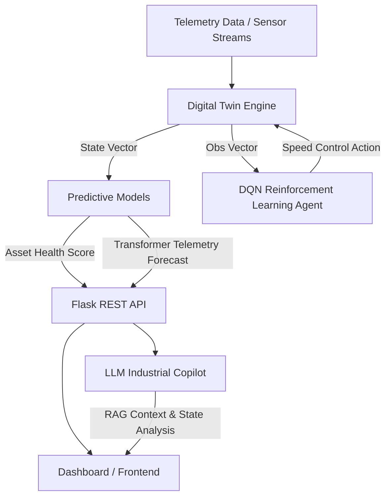

# TwinOpt 🏭🤖

**TwinOpt** is an AI-powered Industrial Digital Twin and Autonomous Factory Optimization platform. It integrates physics-inspired telemetry simulation, machine learning predictive maintenance, deep sequence forecasting, Deep Q-Network (DQN) reinforcement learning for dynamic operational control, and an LLM-driven Industrial Copilot.

---

## 🌟 Key Features

- **Industrial Digital Twin Simulation**: Simulates a 3-stage manufacturing line (`M1 Cutting`, `M2 Processing`, `M3 Assembly`) with real-time physics dynamics including thermal buildup, mechanical vibration, power consumption, and asset health degradation.
- **Predictive Health Analytics (ML)**: Supervised machine learning models (`HealthPredictor`) trained on telemetry features to predict equipment health and flag critical operational conditions.
- **Time-Series Forecasting (Transformer)**: PyTorch-based Transformer forecaster (`TransformerForecaster`) predicting future multi-step telemetry metrics (e.g., thermal and vibration trends).
- **Autonomous Control (RL)**: Reinforcement Learning agent (`DQNAgent`) leveraging Gymnasium environments to dynamically adjust operational speeds, balancing throughput against energy consumption and machine wear.
- **LLM Industrial Copilot**: Generative AI assistant (`IndustrialCopilot`) backed by RAG (FAISS + OpenAI) providing natural language explanations for automated control actions and system diagnostics.
- **Interactive REST API & Dashboard**: Flask backend delivering real-time telemetry streaming, simulation steps, evaluation metrics, and copilot interaction.

---

## 📁 Project Structure

```text
TwinOpt/
├── app.py                     # Flask Web Application & REST API Endpoints
├── generate_data.py           # Synthetic Telemetry Data Generation Pipeline
├── requirements.txt           # Python Project Dependencies
├── README.md                  # Project Documentation
├── digital_twin/              # Factory Line & Equipment Physics Simulation
│   ├── __init__.py
│   └── factory.py             # FactoryLine and Machine State Logic
├── models/                    # ML & Deep Learning Architectures
│   ├── __init__.py
│   ├── ml_model.py            # Asset Health Prediction Models
│   └── transformer.py         # Time-Series Forecasting Transformer
├── rl/                        # Reinforcement Learning Framework
│   ├── __init__.py
│   ├── agent.py               # Deep Q-Network (DQN) Agent Implementation
│   └── environment.py         # Gymnasium Industrial Environment
├── agent/                     # Industrial Copilot & RAG Pipeline
│   ├── __init__.py
│   ├── industrial_agent.py    # LLM Copilot Orchestrator
│   └── knowledge_base/        # RAG Knowledge Embeddings & Prompts
├── evaluation/                # Performance Evaluation & Benchmarking
│   ├── __init__.py
│   ├── evaluate_ml.py         # Machine Learning Evaluation Protocols
│   └── evaluate_rl.py         # Reinforcement Learning Benchmark Metrics
└── notebooks/                 # Exploratory Notebooks & Experiments
```

---

## 🏗️ System Architecture



---

## 🚀 Getting Started

### Prerequisites
- Python 3.9 or higher
- `pip` package manager
- (Optional) CUDA-capable GPU for PyTorch model training

### Installation

1. **Clone the Repository**
   ```bash
   git clone https://github.com/your-org/twinopt.git
   cd twinopt
   ```

2. **Create and Activate a Virtual Environment**
   ```bash
   python -m venv venv
   # On macOS/Linux:
   source venv/bin/activate
   # On Windows:
   venv\Scripts\activate
   ```

3. **Install Dependencies**
   ```bash
   pip install -r requirements.txt
   ```

4. **Generate Synthetic Telemetry Data**
   *(Note: `app.py` auto-generates data on first run if missing, but you can also generate it manually)*
   ```bash
   python generate_data.py
   ```

5. **Configure Environment Variables** (Required for Copilot features)
   ```bash
   export OPENAI_API_KEY="your-openai-api-key"
   ```

---

## 🖥️ Running the Application

Launch the Flask development server:

```bash
python app.py
```

The server will start at `http://0.0.0.0:5000/`.

---

## 🔌 API Reference

| Endpoint | Method | Description |
| :--- | :--- | :--- |
| `/` | `GET` | Serves the interactive control web dashboard. |
| `/api/state` | `GET` | Returns current factory telemetry, machine health, total power, and production history. |
| `/api/step` | `POST` | Advances the factory digital twin simulation by one step using the RL agent's action. |
| `/api/evaluate-ml` | `GET` | Runs evaluation benchmarks on predictive maintenance models and returns metrics. |
| `/api/evaluate-rl` | `POST` | Evaluates DQN agent efficiency against baseline factory control policies. |
| `/api/transformer-predict` | `GET` | Generates sequence prediction for upcoming temperature and vibration trends. |
| `/api/copilot` | `POST` | Queries the LLM Industrial Copilot with current state context and operational queries. |

### Sample Copilot Payload
```json
POST /api/copilot
Content-Type: application/json

{
  "query": "Why was Machine 2 slowed down during the last cycle?"
}
```

---

## 🧮 Data & Physics Models

The data generator (`generate_data.py`) produces realistic telemetry metrics:
- **RPM**: Engine dynamic speed subject to workload scaling.
- **Temperature ($^\circ\text{C}$)**: Dynamic thermal accumulation based on speed and friction.
- **Vibration ($\text{mm/s}$)**: Cumulative mechanical oscillation influenced by speed and health decay.
- **Power Consumption ($\text{kW}$)**: Power usage modeling non-linear load demands.
- **Health Index ($0.0 - 1.0$)**: Non-linear asset degradation driven by thermal and mechanical stress accumulated over operating hours.

---
 